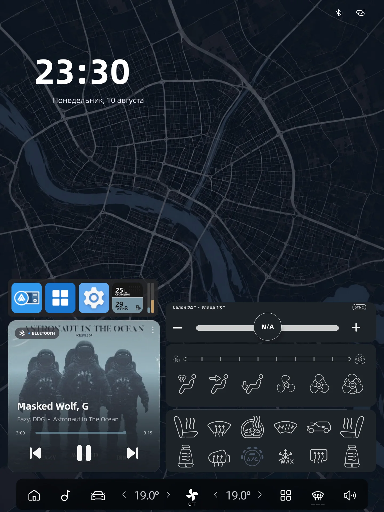
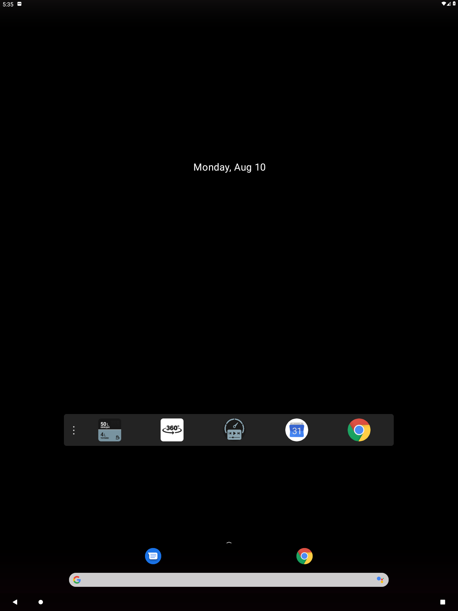
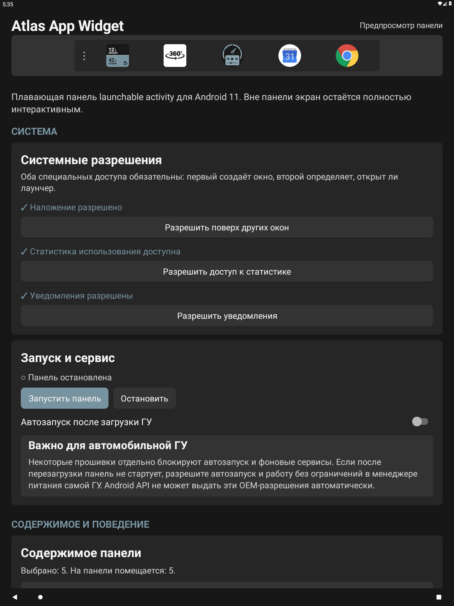
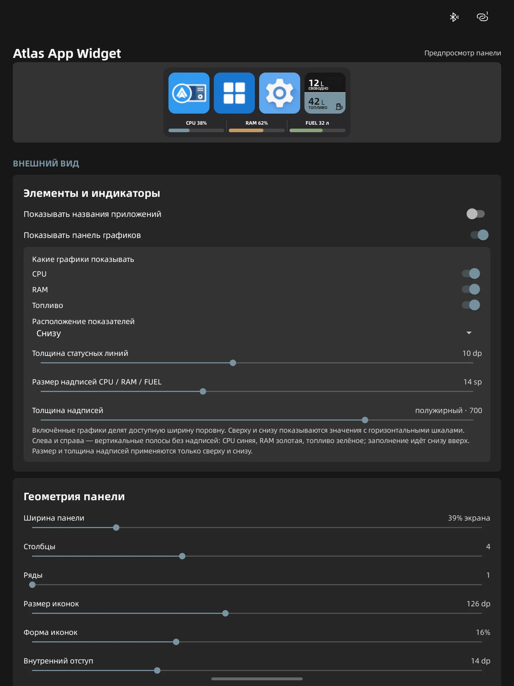
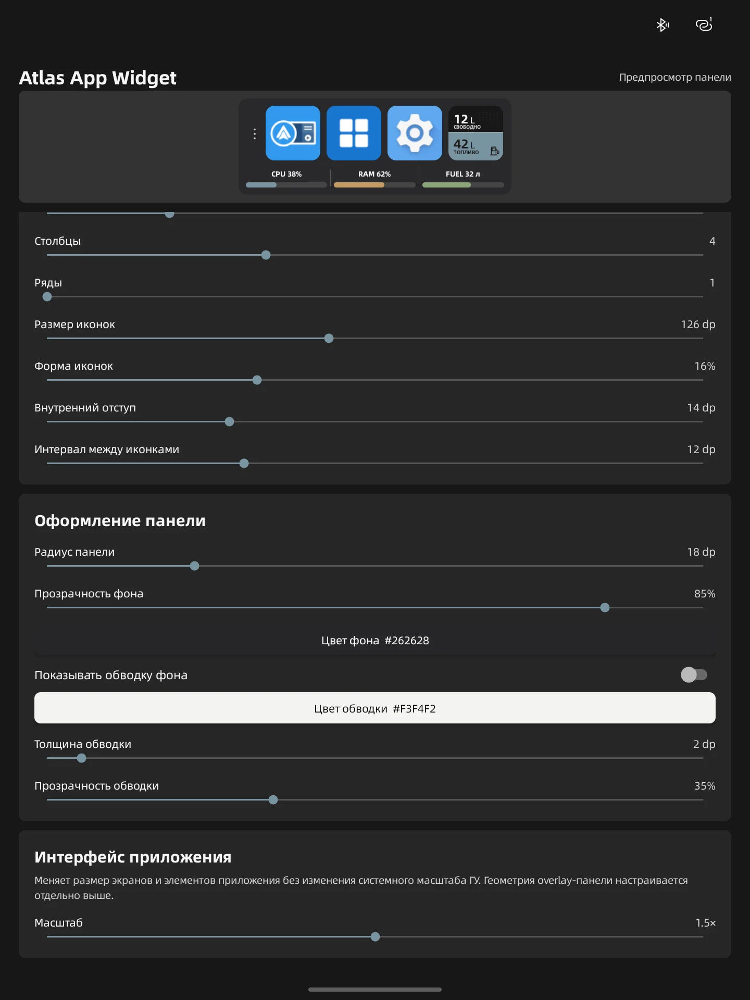

<p align="center">
  
</p>

<h1 align="center">Atlas App Widget</h1>

<p align="center">
  Настраиваемая панель ярлыков для портретных автомобильных ГУ на Android 11
</p>

Atlas App Widget размещает поверх домашнего экрана панель с выбранными приложениями и activity.
Панель появляется только поверх HOME/лаунчера, а остальная часть экрана остаётся интерактивной.

> Несмотря на название, приложение не использует системный `AppWidget`. Панель работает через
> foreground service и окно `TYPE_APPLICATION_OVERLAY`.

## Интерфейс

Панель занимает только выбранную область домашнего экрана: ярлыки остаются доступны поверх HOME,
не перекрывая управление остальными элементами лаунчера.

<p align="center">
  <a href="docs/images/home-overview.webp">
    
  </a>
</p>

<p align="center"><strong>Панель крупным планом</strong></p>

<p align="center">
  <a href="docs/images/overlay-home.webp">
    
  </a>
</p>

Настройки показывают результат в живом предпросмотре. Отдельно регулируются содержимое панели,
системные индикаторы, геометрия и оформление.

<table>
  <tr>
    <th>Запуск и содержимое</th>
    <th>Индикаторы и геометрия</th>
    <th>Оформление панели</th>
  </tr>
  <tr>
    <td>
      <a href="docs/images/settings-overview.webp">
        
      </a>
    </td>
    <td>
      <a href="docs/images/settings-indicators.webp">
        
      </a>
    </td>
    <td>
      <a href="docs/images/settings-appearance.webp">
        
      </a>
    </td>
  </tr>
</table>

## Возможности

- выбор экспортируемых `MAIN`/`LAUNCHER` activity и ручная настройка их порядка;
- импорт собственной картинки для каждого ярлыка и возврат к системной иконке;
- сетка до 10 столбцов и 4 рядов, регулируемые размер, форма и интервалы иконок;
- опциональные однострочные названия приложений;
- настройка ширины, цвета, прозрачности и радиуса панели, а также внешней обводки;
- живой предпросмотр панели на экране настроек;
- графики CPU, RAM и топлива сверху, снизу, слева или справа от ярлыков;
- отдельная живая плитка топлива с экраном подробных данных;
- перетаскивание за ручку с любой стороны панели;
- перемещение после удержания пустого места в течение одной секунды, если ручка скрыта;
- независимый масштаб интерфейса настроек от 1× до 2× без изменения системного масштаба ГУ;
- автозапуск после обычной и Direct Boot-загрузки, включая автомобильный `QUICKBOOT_POWERON`;
- импорт и экспорт переносимых настроек в версионированный JSON;
- сохранение выбранных activity, собственных иконок, положения и оформления при обычном обновлении.

## Требования

- Android 11 или новее (`minSdk 30`);
- портретный экран; целевая конфигурация — 1440×1920;
- разрешение «Поверх других приложений» для окна панели;
- «Доступ к статистике использования» для определения активного HOME/лаунчера.

GInputBridge не нужен для ярлыков, CPU или RAM. Он требуется только для живой плитки и графика
топлива. На совместимой ГУ в GInputBridge должен быть включён Runtime внешнего API.

## Установка и запуск

1. Установите подписанный APK Atlas App Widget и откройте приложение.
2. Выдайте разрешения поверх окон и на статистику использования.
3. Откройте раздел содержимого и выберите нужные приложения, activity или плитку топлива.
4. Настройте сетку и внешний вид по предпросмотру.
5. Нажмите `Запустить панель` и вернитесь на домашний экран.
6. При необходимости включите автозапуск после загрузки ГУ.

Для установки через ADB:

```sh
adb install AtlasAppWidget.apk
```

Если прошивка имеет собственный менеджер автозапуска или энергосбережения, отдельно разрешите в
нём запуск приложения и фоновую работу. Android API не может выдать эти OEM-разрешения.

## Использование

- нажатие на ярлык запускает выбранную activity;
- панель скрывается при переходе из HOME в другое приложение;
- для перемещения используйте ручку или удерживайте пустое место панели одну секунду, если ручка
  отключена;
- нажатие на плитку топлива открывает значение датчика, расчёт литров и время последнего ответа;
- кнопка сброса положения возвращает панель в безопасную область экрана.

## Данные топлива

Плитка и график топлива читают датчик Fuel Percentage из GInputBridge. Стандартная формула Atlas
FX11 — `литры = значение API × 0.466 + 4.4`; результат ограничивается объёмом бака 0–54 л. В
настройках можно задать собственные множитель и смещение. Если GInputBridge не отвечает или данные
устарели, интерфейс показывает недоступное значение, а не сохраняет его бессрочно.

## Перенос настроек

На главном экране в разделе «Система» можно экспортировать конфигурацию в JSON и импортировать её
на этой или другой ГУ. Файл содержит выбранные activity и их порядок, положение overlay, геометрию
и оформление панели, системные индикаторы, формулу топлива, масштаб интерфейса и автозапуск.
Системные разрешения, текущее состояние сервиса и файлы пользовательских иконок в резервную копию
не входят. Импорт не удаляет пользовательские иконки, уже сохранённые на целевой ГУ. Если в
прошивке нет системного выбора файлов, экспорт автоматически сохраняет JSON в папку `Download`.

## Сборка

Требуются JDK 17 и Android SDK 36. Сборка выполняется репозиторным Gradle Wrapper:

```sh
ANDROID_HOME=/path/to/android-sdk sh gradlew --offline clean check assembleRelease
```

Release APK создаётся в `app/build/outputs/apk/release/` с именем вида
`<versionName>[<versionCode>]AtlasAppWidget-release.apk`. Без подключённой локальной release-подписи
имя заканчивается на `-unsigned.apk`.

Для debug-сборки:

```sh
ANDROID_HOME=/path/to/android-sdk sh gradlew --offline assembleDebug
```

Локальная release-подпись подключается через игнорируемый файл `secure.signing.gradle`; пример
находится в [`app/secure.signing.gradle.example`](app/secure.signing.gradle.example). Keystore и
секреты не должны попадать в Git. Application ID проекта — `com.mmwtl.atlasappwidget`.

## Совместимость и ограничения

- основной проверенный сценарий — портретная ГУ на Android 11; поведение других прошивок требует
  проверки на реальном устройстве;
- в список попадают только доступные стороннему приложению `MAIN`/`LAUNCHER` activity;
- область под самой панелью принимает нажатия по ярлыкам и жест перемещения, но окно не блокирует
  остальную часть экрана;
- без Usage Access приложение не может надёжно показывать панель только поверх HOME;
- OEM-прошивка может отдельно ограничить foreground service, автозапуск или работу после загрузки;
- установка обновления поверх APK с другой подписью будет отклонена Android.
